# 散步平溪、深坑、菁桐

http://claire01234567.pixnet.net/blog/post/156423633-%E3%80%8A%E5%B9%B3%E6%BA%AA%EF%BC%8E%E4%B8%80%E6%97%A5%E6%95%A3%E7%AD%96%E3%80%8B2018%E5%B9%B3%E6%BA%AA%E7%B7%9A%E4%B8%80%E6%97%A5%E9%81%8A%EF%BC%8A%E4%BE%86%E5%A0%B4

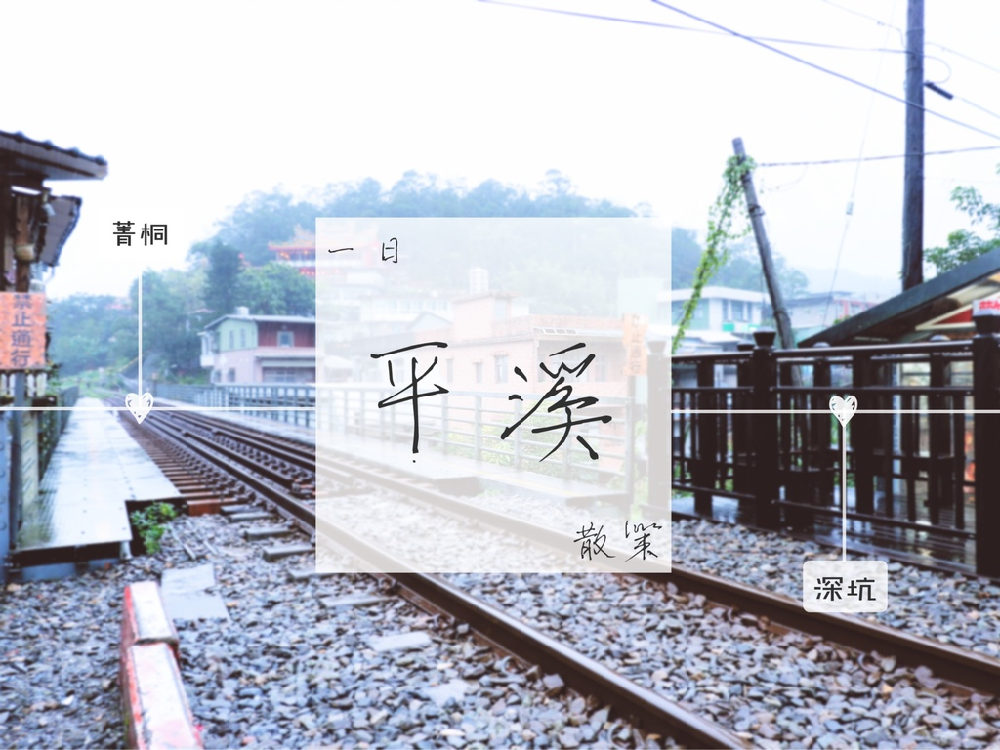


## 公車路線+景點圖

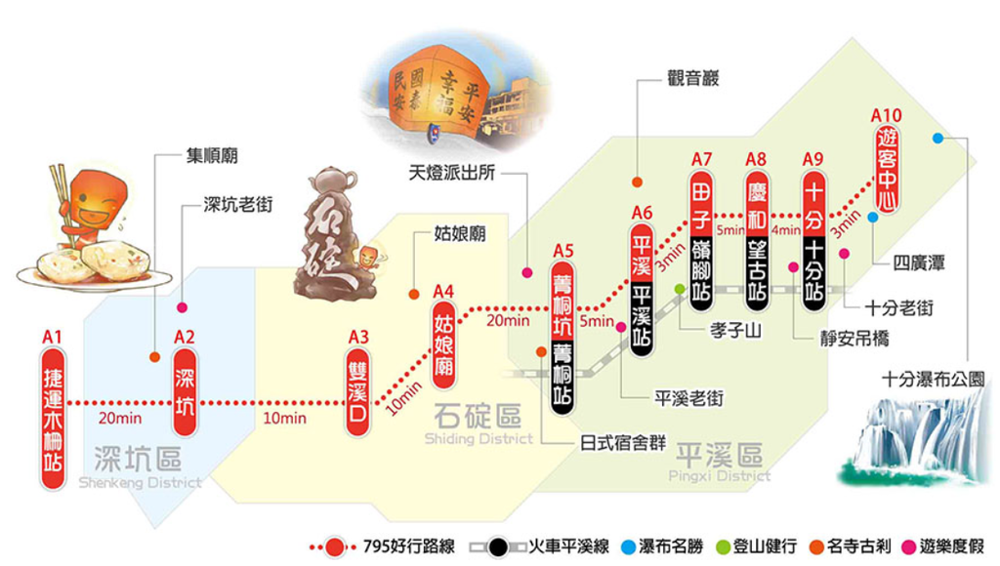


## 推薦路線


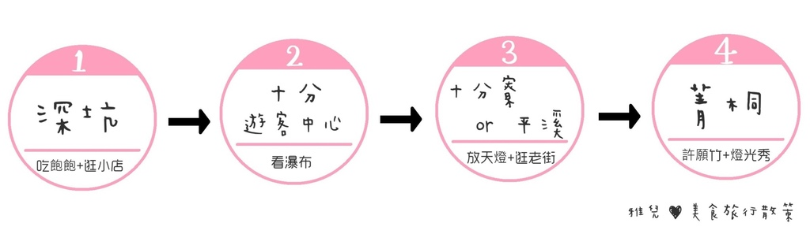


## 怎麼去

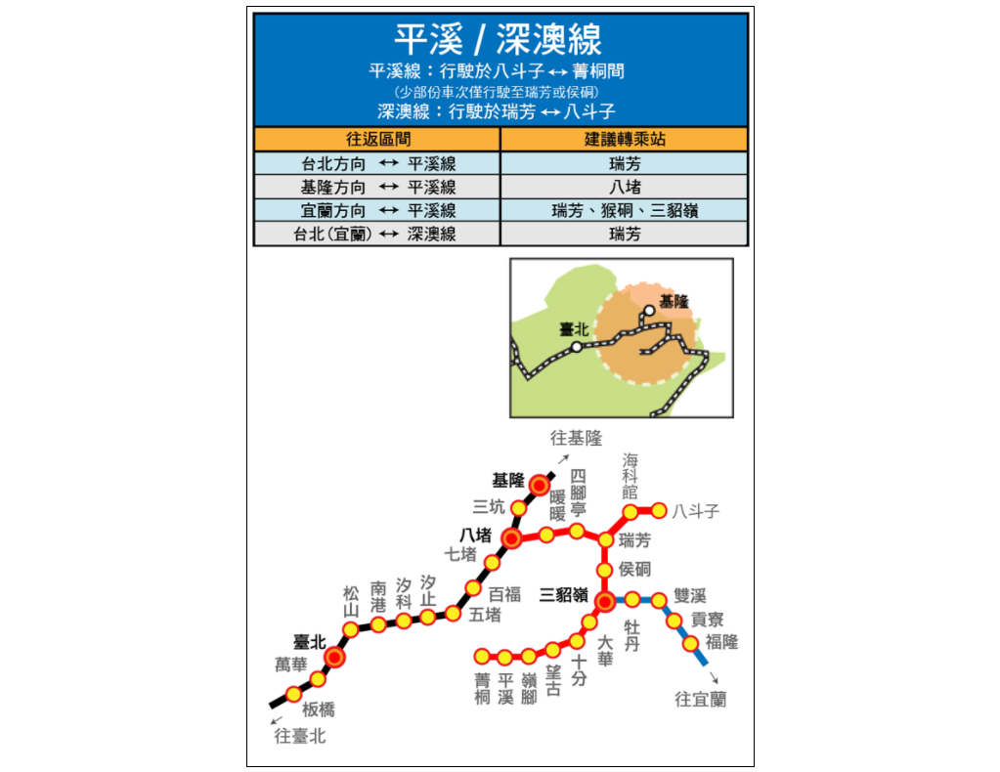


【火車】


```sh
1. 票卷：
    (1) 悠遊卡、一卡通、icash
          A. 價錢：「瑞芳-菁桐」各站單程全票一律15元，再打九折!!
          B. 官方網站：台鐵多卡通營運規範
    (2)台鐵平溪線  一日週遊券
          A. 價錢：售價80元、優待票40元
          B. 發售站：板橋、台北、松山、基隆、八堵、瑞芳、猴硐、宜蘭、羅東、平溪、菁桐、十分
          C. 使用須知
               a. 本券限在各支線使用，限當日使用，未蓋日期戳章者無效。
               b. 旅客可在區間內各站自由上、下車，不限搭乘次數。
               c. 本券一經使用不得退票。
          D. 官方網站：三支線(平溪、內灣、集集)一日週遊券網站、火車路線圖+時刻表

```


2. 走吧！跟著步驟不迷路

```sh
(1) 從「台北火車站」搭乘台鐵到「瑞芳」
     (省下錢跟著做：最便宜的區間車票價49元，用悠遊卡再打九折(=44元)，行車時間36~56分)
(2) 購買一日週遊券 or 刷悠遊卡
      ★離開瑞芳站前，必須在瑞芳的月台先感應悠遊卡(代表出站動作)，一進一出才不會被鎖卡
(3) 轉乘「台鐵平溪線」火車，可搭乘到「十分」、「平溪」、「菁桐」

```


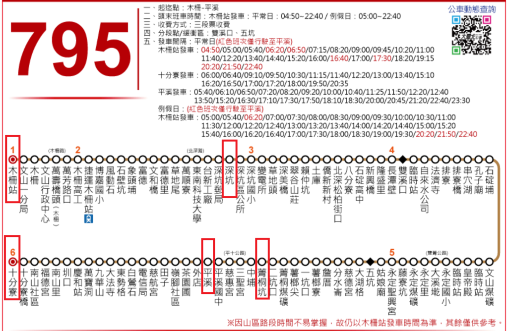

【公車】

### 1. 票卷
```sh
(1) 悠遊卡、一卡通、icash：每段全票15元、半票8元，三段式收費。
(2) 木柵平溪線一日券 (雅兒這次選擇的交通方式~
      A. 價錢：100元
      B. 購票地點：7-11 ibon (木柵站乘車處對面就有7-11喔)
           ibon機台購票步驟：票券中心→交通票→台灣好行
      C. 使用須知：當日不限次數上下車、上下車需提供票券供司機檢閱
(3) 木柵平溪線超值一日電子套票
     A. 價錢：現在優惠價200元，原價450元
     B. 套票內含：
         一卡通一張(儲值使用，可搭車及特約商店消費)
         「台灣好行木柵平溪線」搭乘(內含100元交通車資)
         「波麗士天燈館」電子天燈體驗劵(內含150元天燈體驗券)
          深坑及平溪商家百元商品兌換券(四家特約商店擇其一家兌換100元等值商品)
     C. 官方網站：台灣好行木柵平溪線+購票
     
 
```

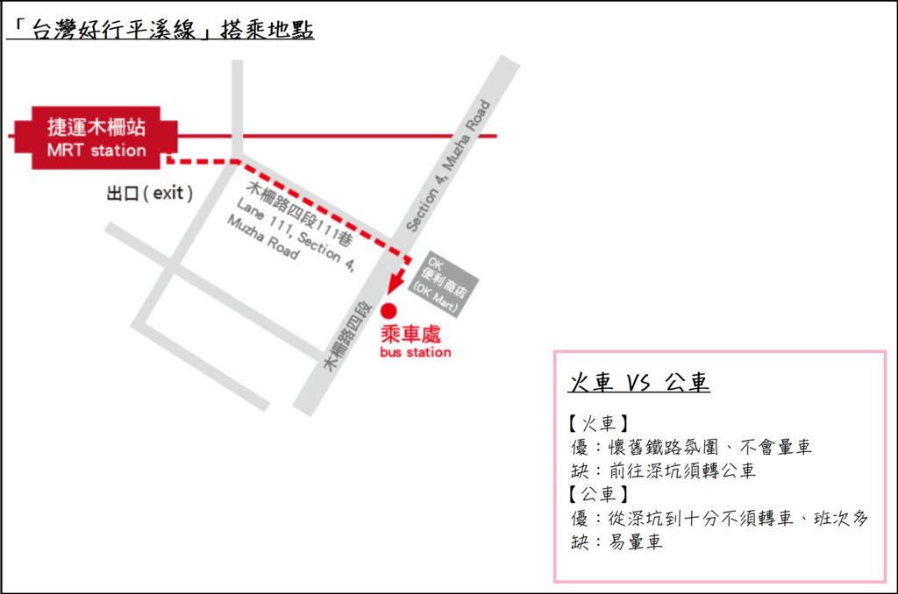

 ###2. 走吧！跟著步驟不迷路
 
```
(1) 購買票卷
(2) 搭乘公車或者捷運到 「捷運木柵站」(和平東路 木柵路出口)
(3) 走路前往「OK便利商店」搭乘「795台灣好行平溪線」
(4) 查看公車時間預估網站：往「十分」、往「木柵」
     實際搭乘時間參考(木柵→深坑15分　深坑→菁桐25分　菁桐→平溪2分  平溪→木柵40分)  
             
         ```
         
## 菁桐
         

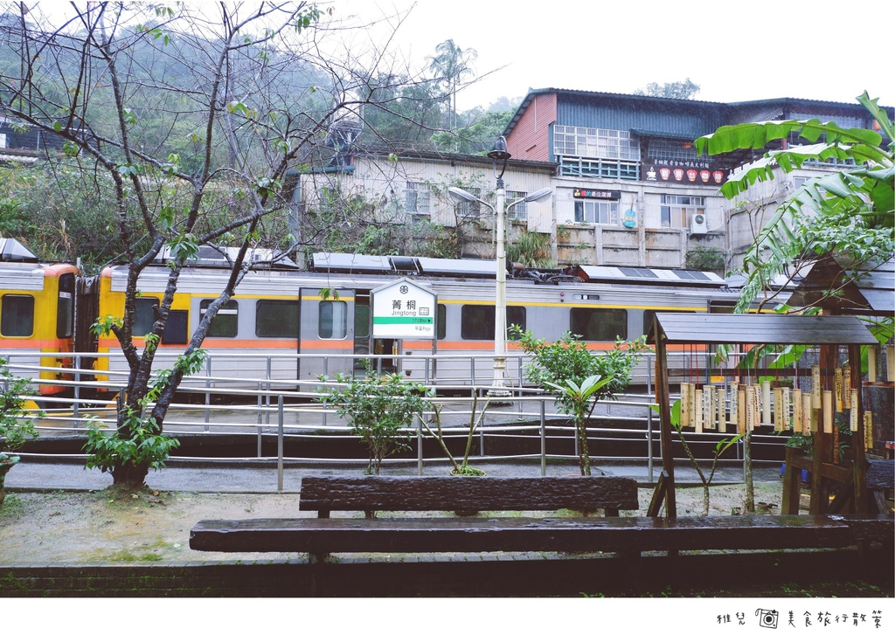

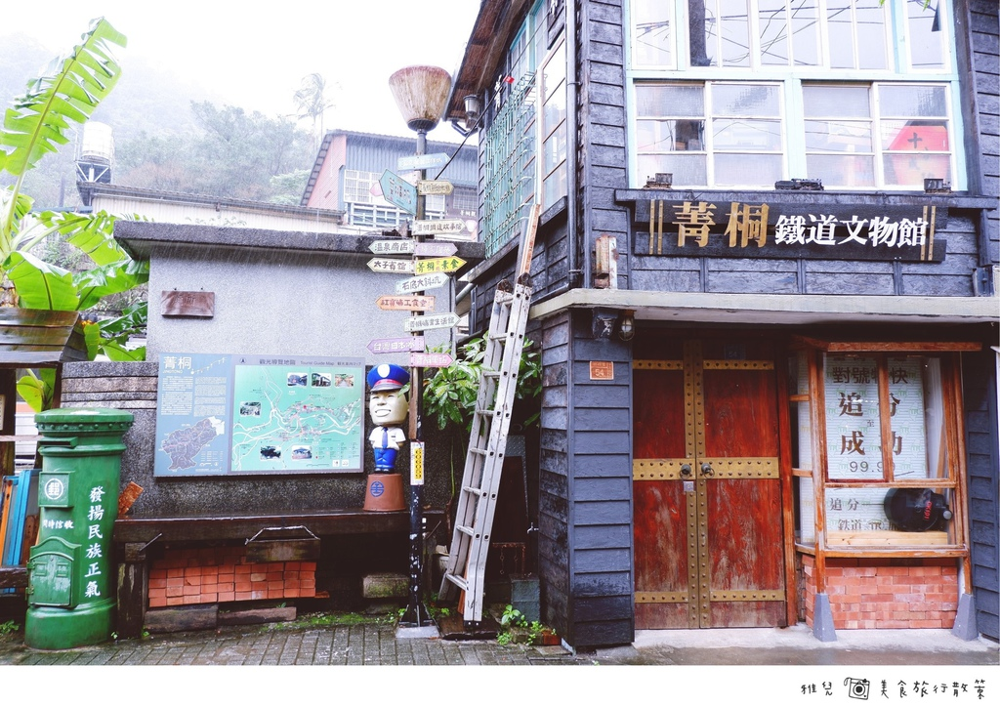

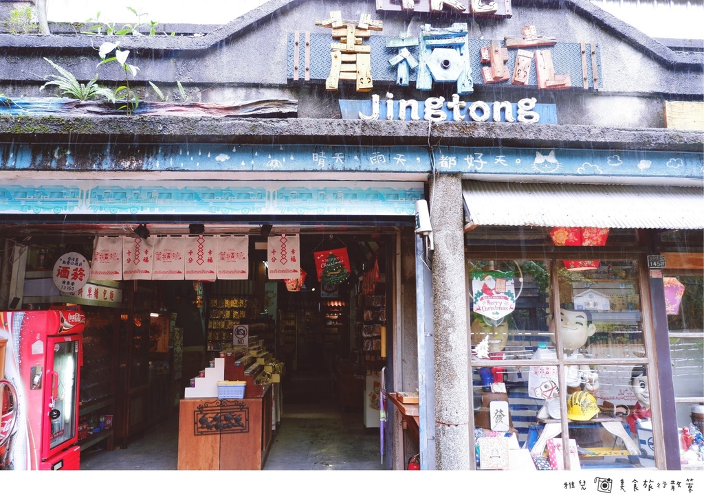


「菁桐」的街道上，幾個小攤販即使在下著大雨的天氣中仍營業著，一排的老房子配上褪色的石版地磚，復古的氛圍。
路牌旁放著可愛的警察雕像，還有綠色、紅色的郵筒，一個小角落就讓雅兒拍不停了~

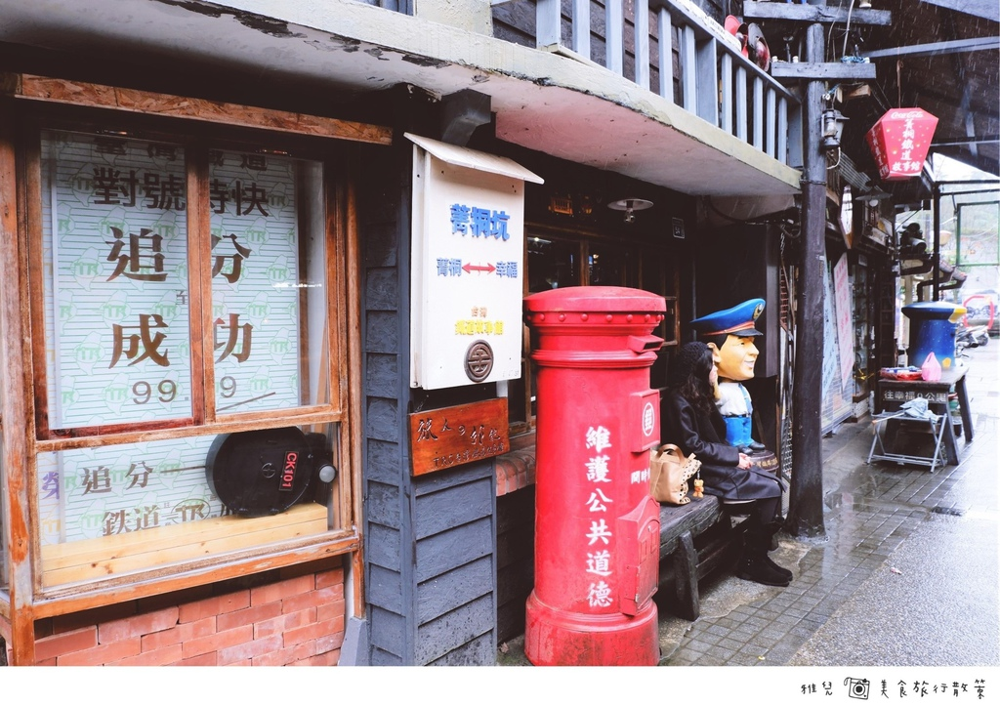


## 深坑
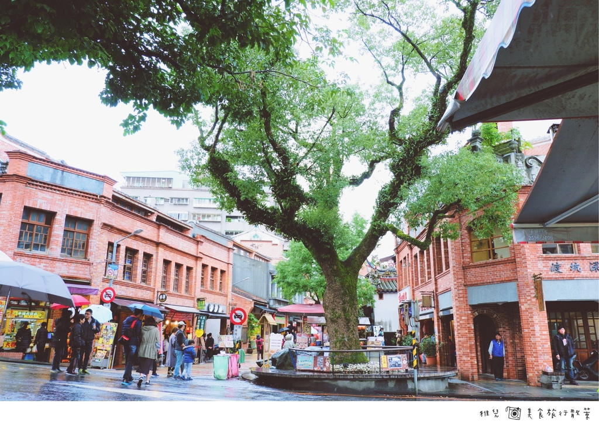

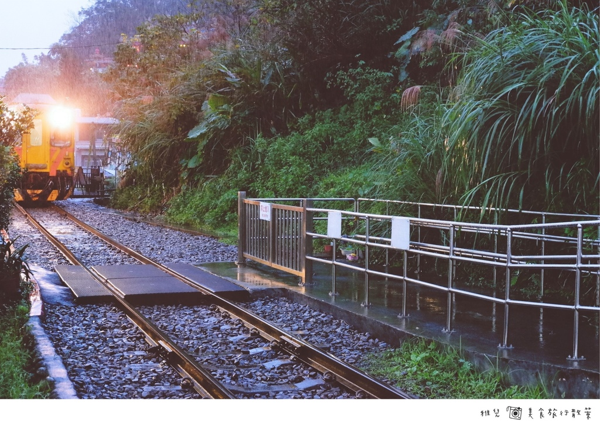


## 平溪

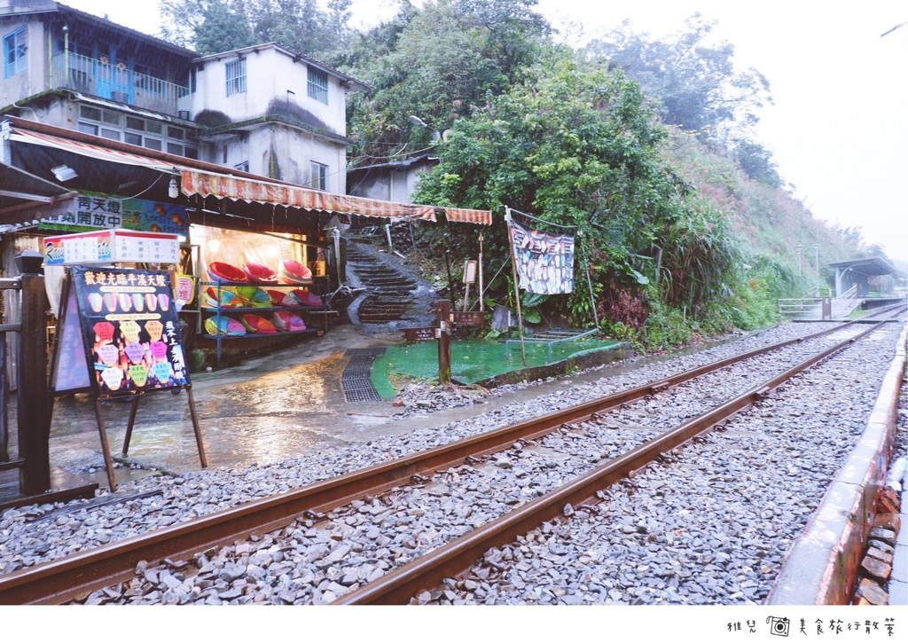
