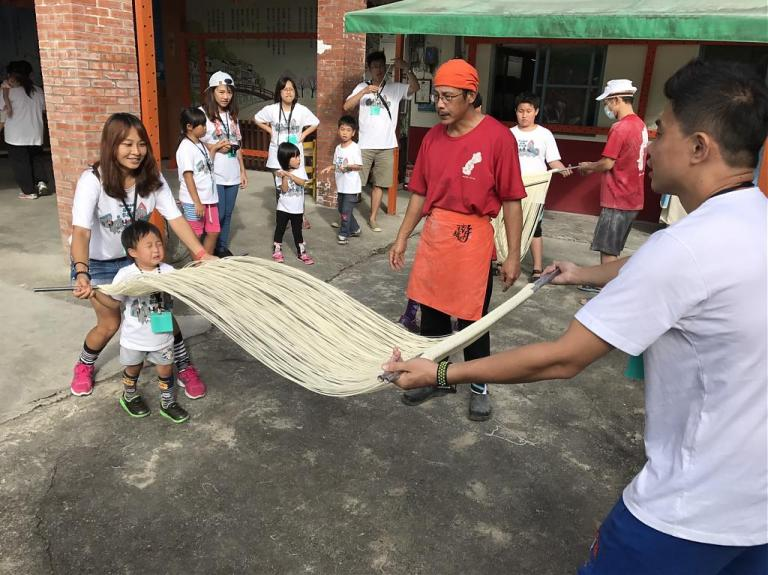
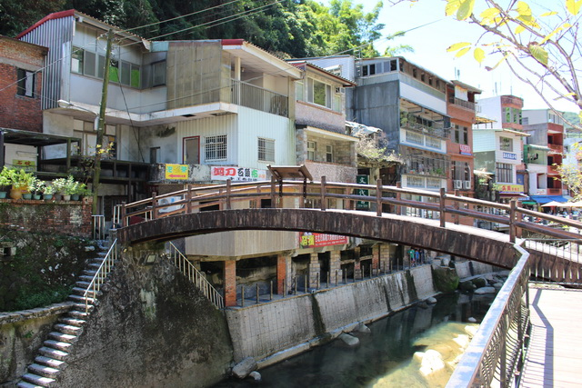
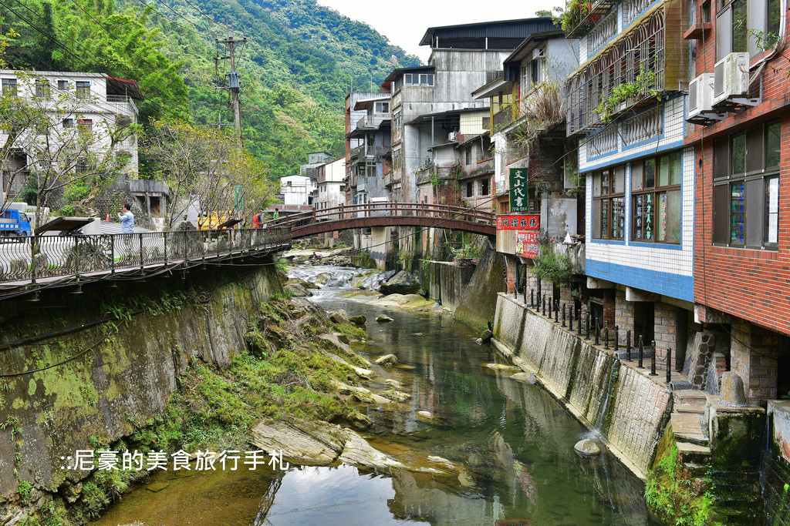
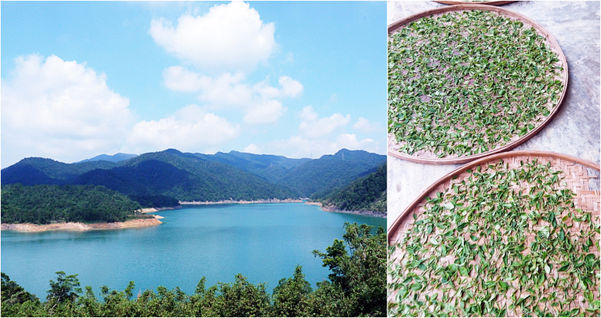
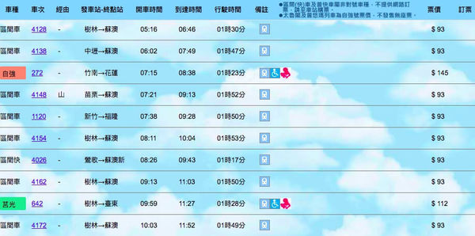
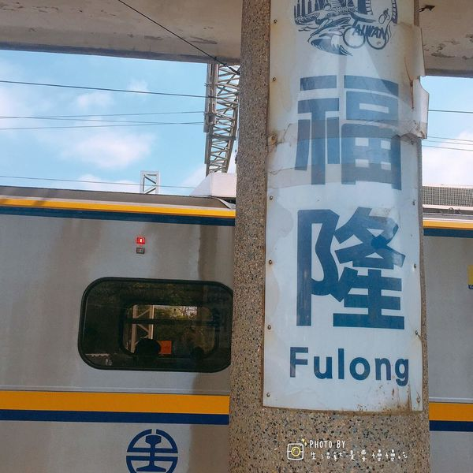
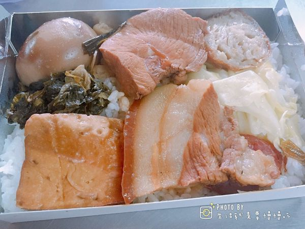
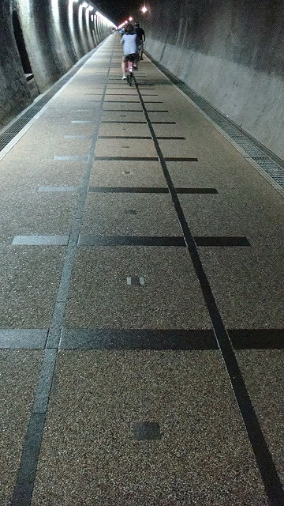
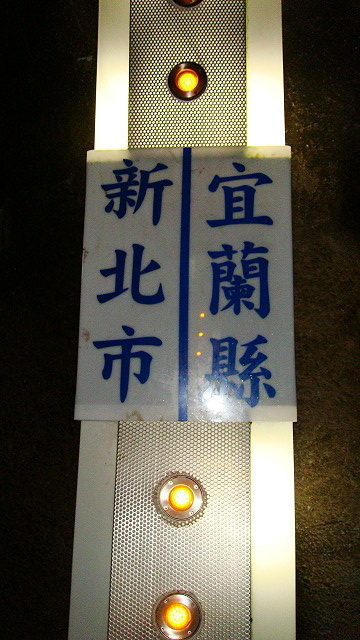
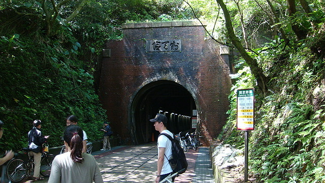

# 台北近郊一日遊

##石碇

https://www.walkerland.com.tw/subject/view/168820

###交通資訊：

- 公車族

    - (1)欣欣客運666北碇線(台北─石碇)。
    - (2)捷運景美站→世新大學→考試院→再興中學→文山行政中心→捷運木柵站→東南技術學院→深坑國小→雙溪口→石碇(車程約五十分鐘，每四十分鐘一班車)。

- 捷運族
    - 捷運木柵線→木柵站(轉欣欣客運666)→石碇區公所站下車(車程約三十分鐘，每四十分鐘一班車)。

### 王氏豆腐

### 石碇麵線

### 石碇麻糬

### 石碇老街

### 石碇千島湖

##福隆

###交通資訊：

- 台北至福隆火車時刻表

### 福隆便當

### 舊草嶺隧道

##鶯歌